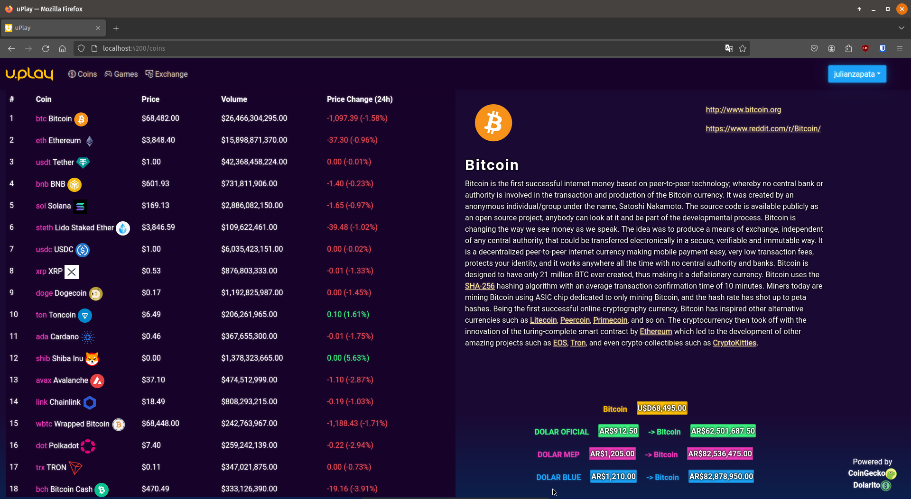
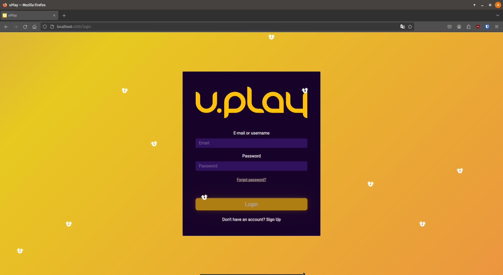
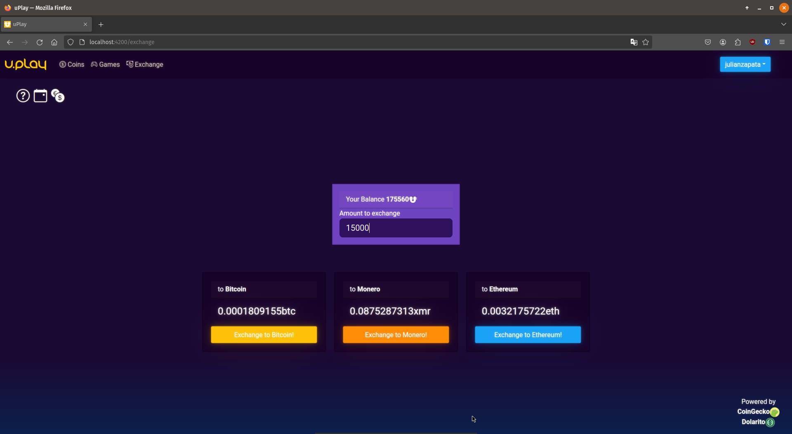

uPlay

uPlay es una aplicación que brinda a los usuarios información sobre criptomonedas integrando datos de APIs en tiempo real. Los usuarios registrados pueden explorar y usar varias funcionalidades relacionadas con el mundo de las criptomonedas para mejorar su experiencia.

Índice
Descripción
Características
APIs Utilizadas
Frontend
Backend
Instalación
Capturas de Pantalla
Descripción
Este proyecto tiene como objetivo desarrollar una aplicación web utilizando Angular para el frontend y Spring Boot para el backend. uPlay integra varias APIs externas para obtener información actualizada sobre criptomonedas, facilitando a los usuarios registrados el acceso a funcionalidades avanzadas como análisis de monedas, comparaciones y más.

Características
Información actualizada sobre criptomonedas en tiempo real.
Sistema de login para usuarios registrados.
Funcionalidades relacionadas con el intercambio de criptomonedas.
Diseño responsivo e intuitivo.
Integración con servicios externos para obtener datos del mercado cripto y del dólar.
APIs Utilizadas
CoinGecko: API para obtener datos de precios de criptomonedas.
Dolarito: API para obtener información actualizada del valor del dólar en Argentina.
Frontend
Angular
La interfaz de usuario está desarrollada con Angular, un framework mantenido por Google que permite crear aplicaciones web dinámicas de una sola página (SPA) y con una arquitectura modular.

Bootstrap
Se utiliza Bootstrap para la creación de una interfaz responsiva y moderna. Gracias a sus componentes y estilos predefinidos, se mejora la experiencia visual y de desarrollo.

Backend
El backend de la aplicación está desarrollado con Spring Boot, facilitando la construcción de servicios RESTful para manejar las interacciones del usuario y la gestión de datos. Puedes ver el código fuente del backend aquí: Backend API.
Link ---> https://github.com/1auti/u-play-backend

Spring Boot
Spring Boot es un framework que permite el desarrollo de aplicaciones Java empresariales de forma rápida y eficiente. En este proyecto, Spring Boot gestiona la lógica del negocio y la conexión con las APIs externas.

Instalación
Requisitos
Node.js y npm instalados (para ejecutar Angular).
Java y Maven (para el backend con Spring Boot).
Pasos de Instalación
Clonar el repositorio del frontend:
bash
Copy code
git clone https://github.com/1auti/u-play-frontend.git
cd uPlay
Instalar dependencias de Angular:
bash
Copy code
npm install
Iniciar la aplicación de Angular:
bash
Copy code
ng serve
Clonar el repositorio del backend:
bash
Copy code
git clone https://github.com/alanmedina1995/apiUplay.git
cd apiUplay
Ejecutar el backend:
bash
Copy code
mvn spring-boot:run
Capturas de Pantalla
Landing Page

Login

Exchange
